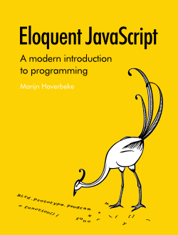

## 📚 Ebooks de Eloquent JavaScript
¡Bienvenidos al repositorio de **Ebooks de Eloquent**! 🎉

Aquí encontrarás una **colección de libros de JavaScript** traducidos por la comunidad (como en ingles 😟), con el objetivo de facilitar el acceso al conocimiento y ayudar a todos los programadores a dominar JavaScript para el desarrollo web del lado del cliente. 🚀 

### [HTML]
|img | Edition| HTML | PDF |
|----|--------|------|-----|
|  |1era Edition | [EN](https://eloquentjavascript.net/1st_edition/)  | [ pdf -EN ](EbookEloquent/Eloquent_JavaScript_EN.pdf) |
|  |2da Edition |  [EN](https://eloquentjavascript.net/2nd_edition/)  | [ pdf - EN](EbookEloquent/Eloquent_JavaScript_2nd_EN.pdf) |
|  |3ra Edition |  [EN](https://eloquentjavascript.net/3rd_edition/)  | [ pdf - ES](EbookEloquent/Eloquent_JavaScript_3ra_ES.pdf)
|  |4ta Edition |  [EN](https://eloquentjavascript.net/)  /  [ES](https://www.eloquentjavascript.es/)| [pdf - ES](EbookEloquent/Eloquent_JavaScript_4ta_ES.pdf) |

JavaScript es un lenguaje fundamental para cualquier desarrollador web, y aprenderlo correctamente te permitirá crear aplicaciones más poderosas y eficientes. Es por eso que he creado este espacio, donde podrás descargar, leer, y compartir libros que cubren desde los conceptos básicos hasta técnicas avanzadas de JavaScript.

### ¿Tienes un ebook que quieras compartir? 📤

Si tienes algún ebook de JavaScript que te haya sido útil o si has traducido material relevante y quieres compartirlo con la comunidad, **¡este es el lugar indicado!**. Estás invitado a contribuir subiendo tus libros y guías en este repositorio. 💻✨

### ¿Cómo colaborar?

1. Haz un **fork** del repositorio.
2. Sube tu ebook o libro a la carpeta correspondiente.
3. Crea un **pull request** para que lo revisemos y lo añadamos.
4. Si no sabes dónde colocar tu libro, agrégalo a la carpeta **Others** o me escribes al correo gnuxdar[@]gmail.com.

Cada contribución es valiosa y ayudará a otros programadores a aprender JavaScript de la mejor manera posible. 🌱💪

### ¡Gracias por ser parte de esta comunidad de aprendizaje! ❤️

