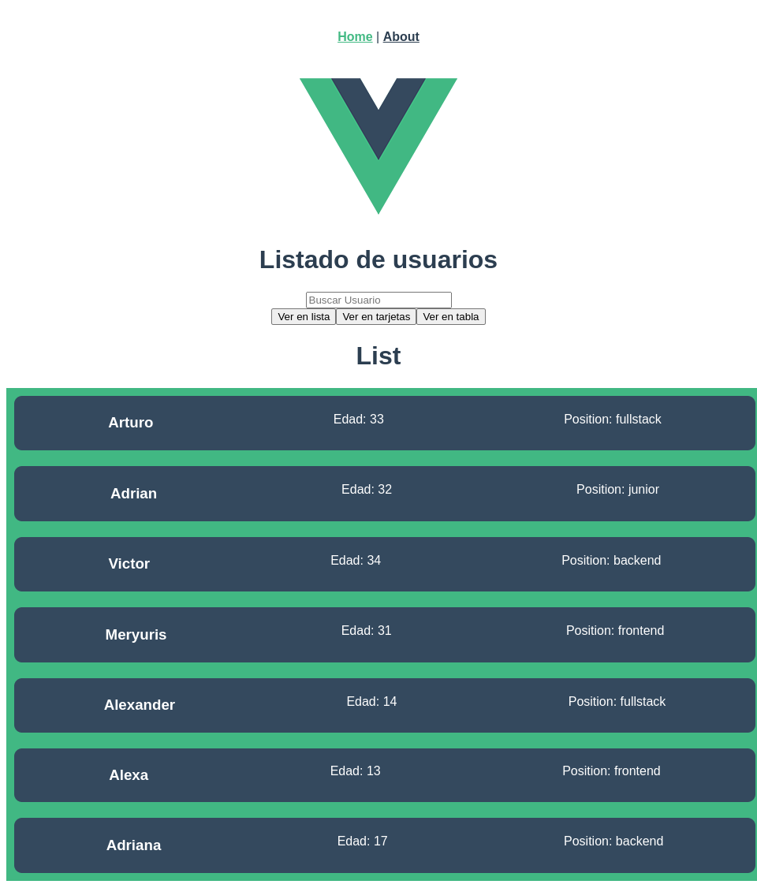

# vue-dynamic-components

Permite cargar y renderizar componentes de forma dinamica en funcion de ciertas condiciones o eventos en tu aplicacion. Esto es util cuando deseas cambiar la interfaz de usuario de forma dinamica (Ejm: Modo oscuro)

Uso de componentes dinamicos, usualmente se utilizan para backoffice, mostrar data de diversas maneras o formatos.

Estos compomentes se suelen agregar en una carpeta layout o en components

## Project setup
```
npm install
```

### Compiles and hot-reloads for development
```
npm run serve
```

### Compiles and minifies for production
```
npm run build
```

### Lints and fixes files
```
npm run lint
```

### Customize configuration
See [Configuration Reference](https://cli.vuejs.org/config/).
