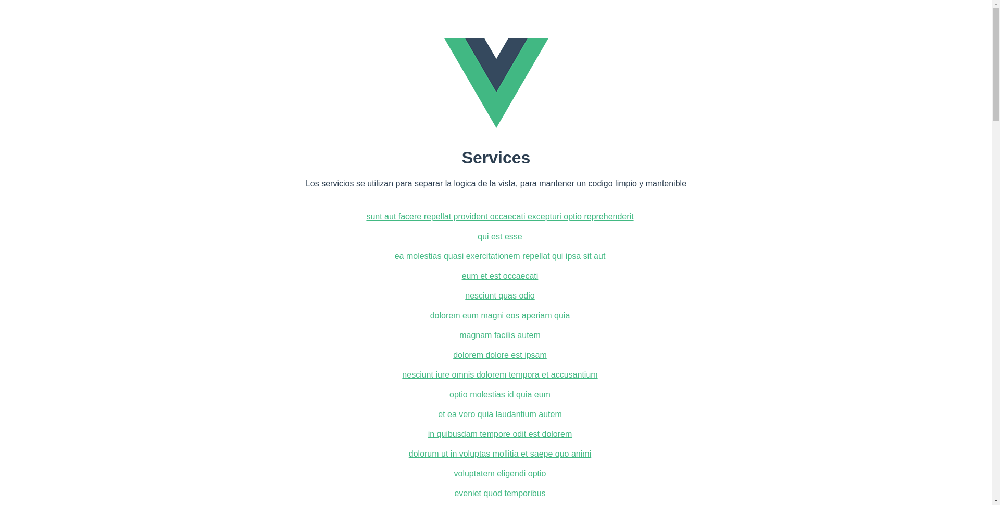

# Services

En el contexto de Vue.js, el término "servicios" generalmente se refiere a la implementación de una lógica de negocio o funcionalidad reutilizable que no está directamente relacionada con la vista (la capa de presentación) de tu aplicación. Los servicios en Vue.js se utilizan para separar la lógica de la vista y mantener un código limpio y mantenible.

Los servicios pueden ser clases o módulos que encapsulan funciones y datos relacionados con una característica específica de tu aplicación. Aquí hay algunos ejemplos de cómo puedes implementar servicios en Vue.js:

1. **Usar clases para definir servicios:** Puedes crear una clase JavaScript para representar un servicio y luego instanciar esa clase donde sea necesario en tu aplicación. Por ejemplo:

```javascript
// Definición de un servicio como una clase
class UserService {
  // Métodos para interactuar con usuarios
  getUsers() {
    // Lógica para obtener usuarios
  }

  createUser(user) {
    // Lógica para crear un usuario
  }

  // Otras funciones relacionadas con usuarios
}

// Uso del servicio en un componente Vue
import { ref, onMounted } from 'vue';

export default {
  setup() {
    const userService = new UserService();

    const users = ref([]);

    onMounted(async () => {
      users.value = await userService.getUsers();
    });

    return { users };
  },
};
```

2. **Usar módulos para definir servicios:** Puedes crear módulos JavaScript que exporten funciones y datos relacionados con un servicio específico. Estos módulos se pueden importar y utilizar en componentes Vue según sea necesario.

```javascript
// userService.js - Módulo de servicio
export function getUsers() {
  // Lógica para obtener usuarios
}

export function createUser(user) {
  // Lógica para crear un usuario
}
```

```javascript
// Uso del servicio en un componente Vue
import { ref, onMounted } from 'vue';
import { getUsers } from './userService.js';

export default {
  setup() {
    const users = ref([]);

    onMounted(async () => {
      users.value = await getUsers();
    });

    return { users };
  },
};
```

3. **Usar bibliotecas de administración de estado:** En aplicaciones más grandes, a menudo se utiliza una biblioteca de administración de estado como Vuex para gestionar servicios y datos globales de manera más organizada.

En resumen, los servicios en Vue.js se utilizan para encapsular la lógica de negocio o la funcionalidad reutilizable en tu aplicación. Esto ayuda a mantener tus componentes Vue limpios y centrados en la presentación, mientras que la lógica subyacente se administra en servicios separados. La elección de cómo implementar servicios depende de la estructura y las necesidades específicas de tu aplicación.

# Other
uso de Interface

# Instalar Pre Procesadores CSS (sass)
    npm install -D sass-loader sass  
    ó  
    npm install -D less-loader less  

# Instalar Framework css (bootstrap)

    npm install --save bootstrap  

## Project setup
```
npm install
```

### Compiles and hot-reloads for development
```
npm run serve
```

### Compiles and minifies for production
```
npm run build
```

### Lints and fixes files
```
npm run lint
```

### Customize configuration
See [Configuration Reference](https://cli.vuejs.org/config/).
