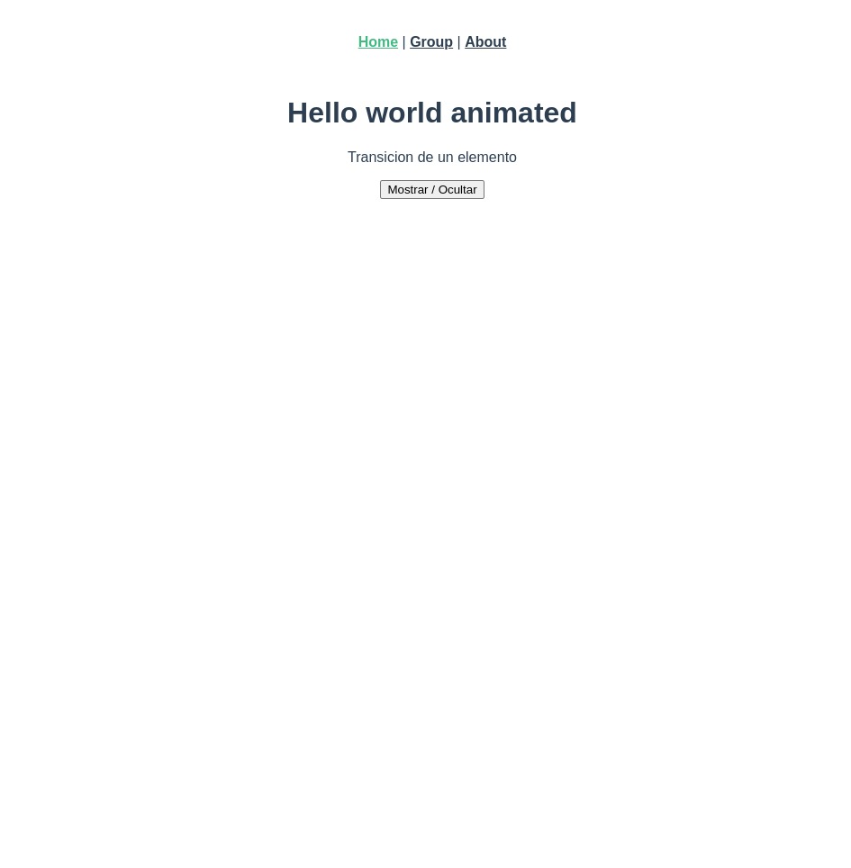
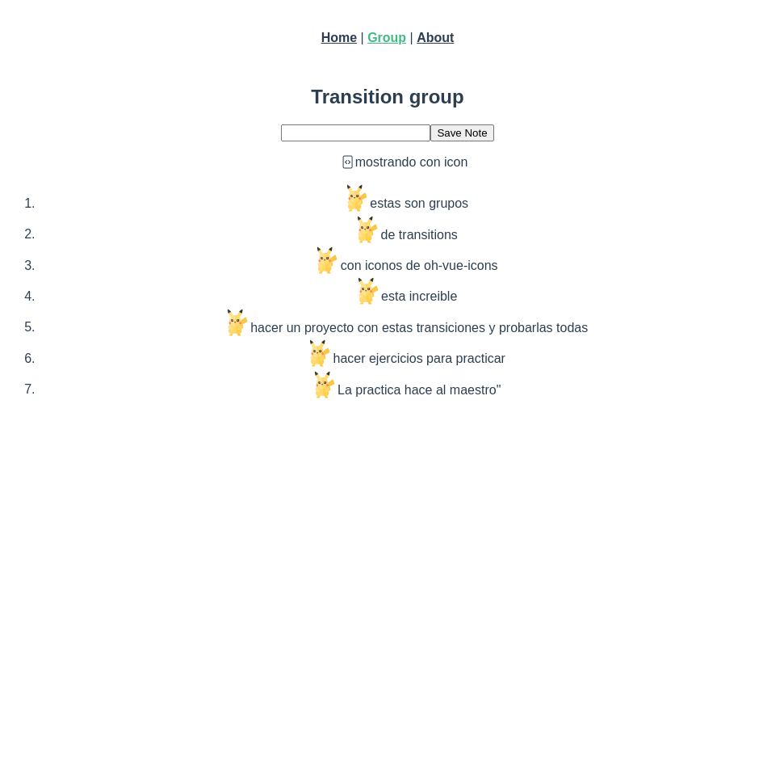

# transitions
Las transiciones en Vue.js permiten crear animaciones y efectos de transición cuando un elemento se inserta, actualiza o elimina del DOM. Las transiciones se utilizan comúnmente para mejorar la experiencia del usuario al hacer que las operaciones de interfaz de usuario sean más suaves y agradables visualmente.

En Vue.js, las transiciones se pueden lograr utilizando el elemento <transition> o la propiedad transition en un componente.




## Config
```
npm install oh-vue-icons
```

```
...
import { OhVueIcon, addIcons } from "oh-vue-icons";
import { BiFileCode, PiPichuShiny, PiPikachu } from "oh-vue-icons/icons";  //paquete de icons, podemos importar todos los que necesitemos

addIcons(BiFileCode, PiPichuShiny, PiPikachu);

const app = createApp(App)
app.component("v-icon", OhVueIcon);
app.use(router).mount('#app')

```

## Project setup
```
npm install
```

### Compiles and hot-reloads for development
```
npm run serve
```

### Compiles and minifies for production
```
npm run build
```

### Lints and fixes files
```
npm run lint
```

### Customize configuration
See [Configuration Reference](https://cli.vuejs.org/config/).
