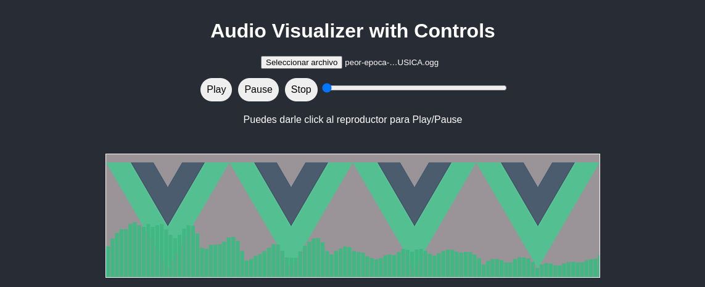

# Componenetes creados en Vue.js

1. **vue_audiovisualizer**: ES una Espectograma para los audio, un inout file que carga el fichero y se reproduzca con su espectograma de audio.  
 

2. **vue_trello**: ES un clon de trello, que hice siguendo el tutorial de Carlos Azaustre. Adaptando a vue3 (StandBy)  
 

1. **vue_memory**: Un juego de memoria que se desarrolla con el increible Vue.js 3  
 

* **otros prontos...**