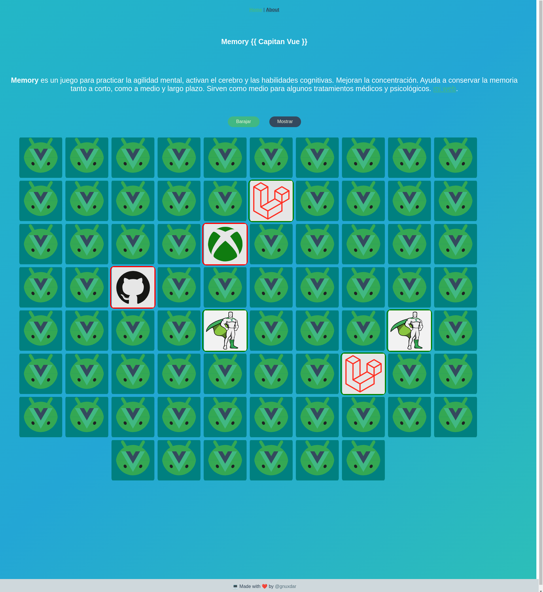

 

# vue_memory
Es un juego de memoria, donde ayudamos a tener una optimizacion mental gracias a Capitan Vue
## Project setup
```
npm install
```

### Compiles and hot-reloads for development
```
npm run serve
```

### Compiles and minifies for production
```
npm run build
```

### Lints and fixes files
```
npm run lint
```

### Customize configuration
See [Configuration Reference](https://cli.vuejs.org/config/).

## Install tsparticles
[vue3](https://github.com/tsparticles/vue3/#readme)
npm install @tsparticles/vue3 tsparticles
<!-- npm install tsparticles -->

### En main.js

import Particles from "@tsparticles/vue3";
//import { loadFull } from "tsparticles"; // if you are going to use `loadFull`, install the "tsparticles" package too.
import { loadSlim } from "@tsparticles/slim"; // if you are going to use `loadSlim`, install the "@tsparticles/slim" package too.

createApp(App).use(Particles, {
  init: async engine => {
    // await loadFull(engine); // you can load the full tsParticles library from "tsparticles" if you need it
    await loadSlim(engine); // or you can load the slim version from "@tsparticles/slim" if don't need Shapes or Animations
  },
});

